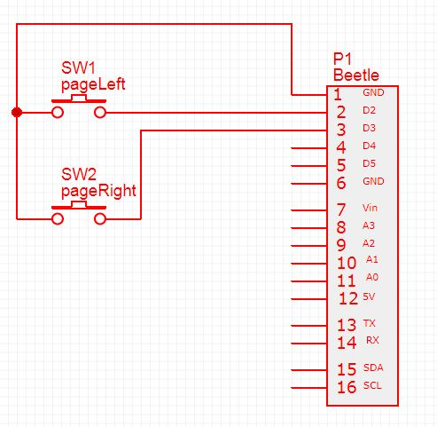
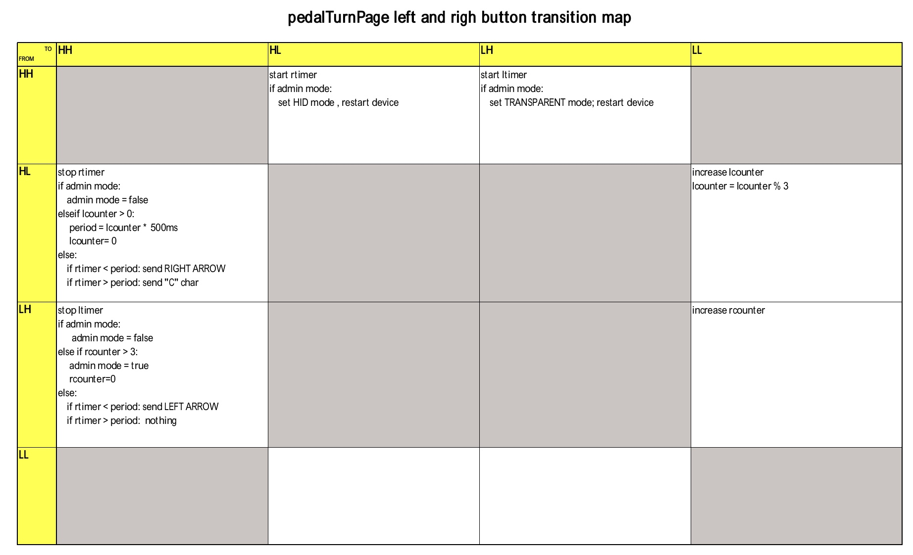

## pedalPageTurn ##

This is the Arduino code for a DFRobot Beetle BLE Bluno microcontroller as a HID keyboard sending left and right cursor code when buttons are pushed

# Electronic schema #

This is very simple:

# Photos of the Prototype

# To do #

Implement enhanced functionality using the left & right button
* Actions *

- Left button (red button) short press sends a left cursor keystroke when released
- right button (blue button) short press sends a right cursor keystroke when released
- right button long press send a "c" character when release

- if you maintain the right button pressed while pressing the left one, it changes the longpress period from 500ms to 1s

- if you maintain the left button pressed while pressing three times the right one, it enter the admin mode.
-- then pressing the left button set the Beetle BLE device in Central role and transparent mode
-- or pressing the right button set the device in Peripheral and HID mode

The following table resumes the actions taken according to buttons' state changes:

