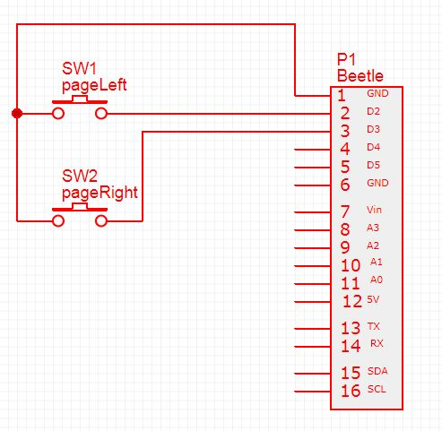
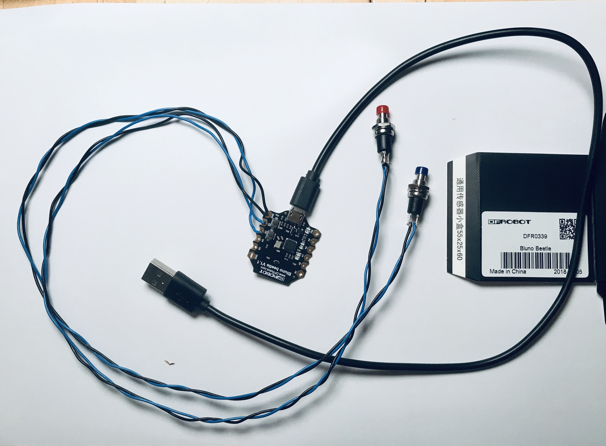
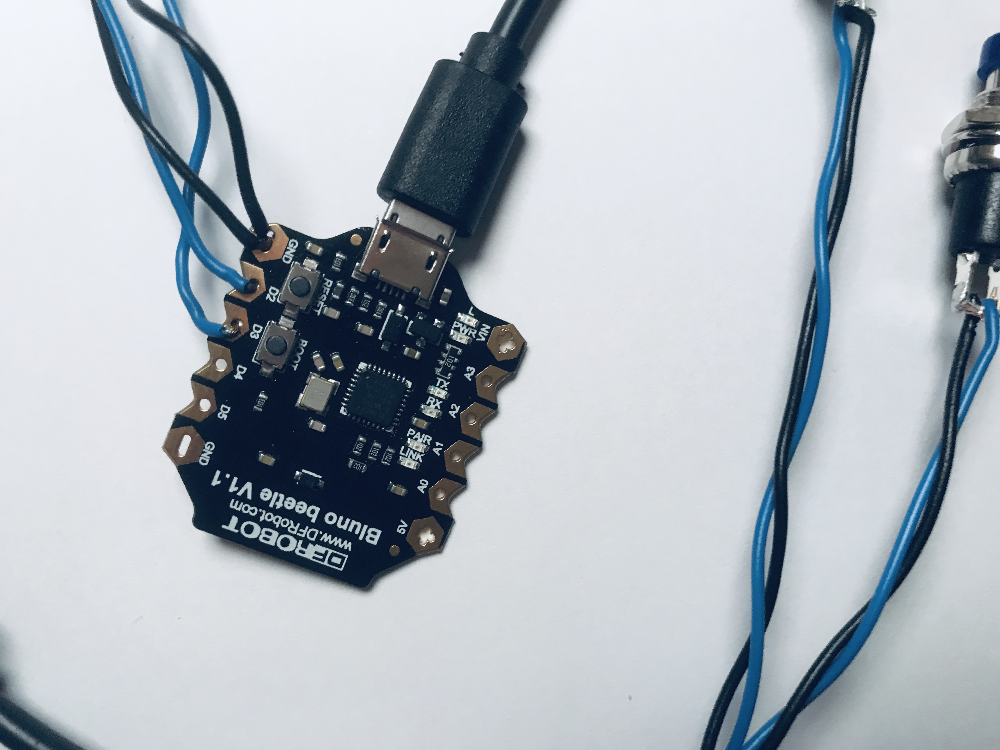
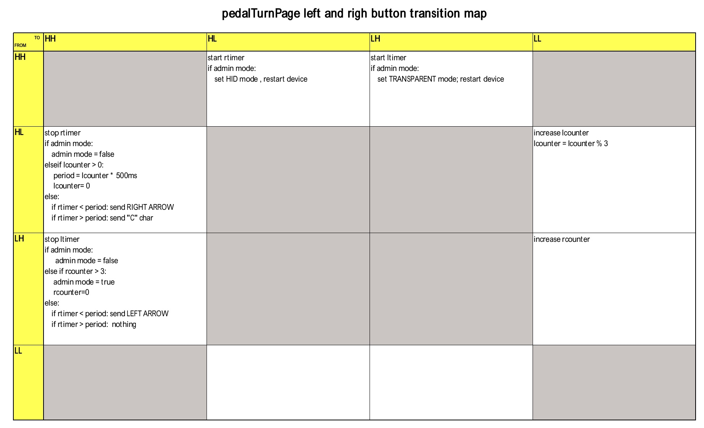

## turnPagePedal ##

turnPagePedal is a project to create a two-buttons pedal device that enables page turns for a score displaying application on a tablet.

It emulates a keyboard to basically send the cursor left/right commands. Additional commands may be sent by programming long press on one of the pedal button to actionate da-capo or cross page jumps command.

Special combinations of putton presses allow entering in admin mode and configuring some behaviour or parameters of the device.

This repo also contains the Arduino code for a DFRobot Beetle BLE Bluno microcontroller as a HID keyboard sending left and right cursor code when buttons are pushed

# Electronic schema #

This is very simple:

# Photos of the Prototype

# Functional behaviour #

**Normal mode**

The following functionality is implemented when using the left & right buttons:

- Left button (red button) short press sends a left cursor keystroke when released
- right button (blue button) short press sends a right cursor keystroke when released
- left button long press send a "c" character when released 

- if you maintain the right button pressed while pressing the left one n times, it changes the longpress period from 500ms to ntimes * 500 ms (max 3000 ms)

**Admin mode**

Maintain the left button pressed while pressing three times the right one to enter the admin mode:

- press the left button set the Beetle BLE device in Central role and transparent mode
- or press the right button set the device in Peripheral and HID mode

**Button state transition table**

The following table resumes the actions taken according to buttons' state changes.

Rows indicates the 'FROM' state; columns the 'TO' state.
States are represented by a two letters code indicating the respective **H**igh or **L**ow state of the left and right buttons. So '**LH**' means that the left button is being pressed, while the right button not.

